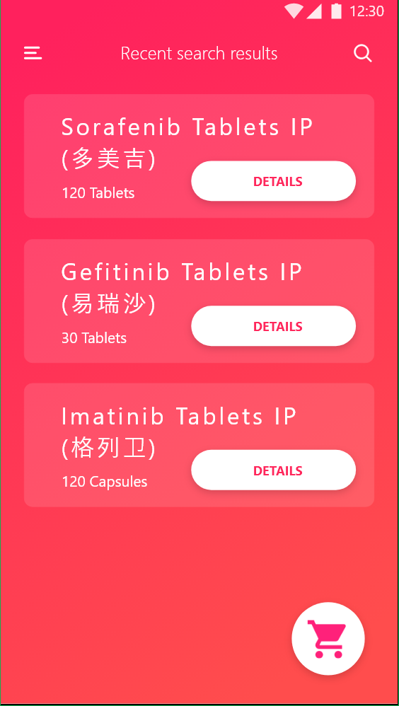

# medchain-box

<div align=center></div>

A box came from TC SHENZHEN Hackathon 2018. This box is contributed by [cydalytics](https://github.com/cydalytics).

```shell
 _  _         _        _   _               _____ ___ 
| || |__ _ __| |____ _| |_| |_  ___ _ _   |_   _/ __|
| __ / _` / _| / / _` |  _| ' \/ _ \ ' \    | || (__ 
|_||_\__,_\__|_\_\__,_|\__|_||_\___/_||_|   |_| \___|
   ___  ___ ______    ______                __          
  |_  |/ _ <  ( _ )  / __/ /  ___ ___  ___ / /  ___ ___ 
 / __// // / / _  | _\ \/ _ \/ -_) _ \/_ // _ \/ -_) _ \
/____/\___/_/\___/ /___/_//_/\__/_//_//__/_//_/\__/_//_/
```

If you find this box is helpful, you can endorse them through Linkedin!</font></b>

- Yeung Wong - https://www.linkedin.com/in/yeungwong/

- Carrie Lo - https://www.linkedin.com/in/carrielsc/

<table frame=void rules=none>
<tr>
<td>
<a><div align=center></div></a>
</td>
<td>
<a><div align=center></div></a>
</td>
<td>
<a><div align=center></div></a>
</td>
<td>
<a><div align=center></div></a>
</td>
</tr>
</table>